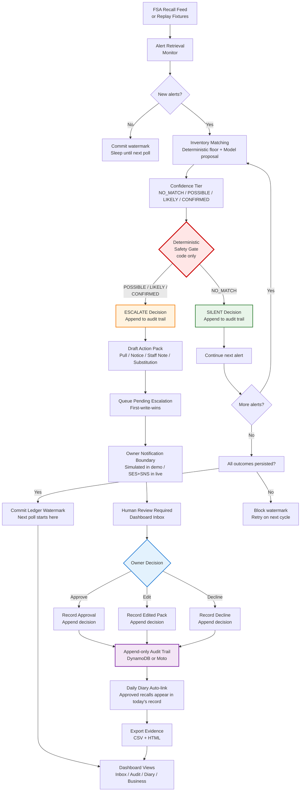

# AllerGuard

AllerGuard is a conservative autonomous food-recall monitoring and owner-review system for small UK food businesses. It watches Food Standards Agency (FSA) recall alerts against a business's specific inventory, maintains a daily safety record in the background, and surfaces decisions to the owner only when genuine human judgment is required.

## Live application or demonstration

**Local interactive dashboard:** a FastAPI/Jinja web interface is implemented and browser-verified on Windows. Launch it with:

```powershell
.\.venv\Scripts\python.exe -m scripts.serve_dashboard
```

Then open `http://127.0.0.1:8000`, choose **Start demo**, then **Run replay demo**. The demonstration processes five real FSA recall fixtures through deterministic matching, produces two silent decisions and three escalated decisions, and records eleven audit events. Approving, editing, or declining a pending escalation records the owner's choice; these choices do not execute stock removal or customer communication.

**Offline demo mode:** the complete monitoring cycle, notification boundary, owner approval path, diary preparation, and unified evidence export run end-to-end using Moto (in-memory AWS emulation) and injected assessment proposals. Moto history is lost on process restart. This mode demonstrates the orchestration and persistence contracts; it is not live AWS verification.

**AWS evidence mode:** separate real DynamoDB audit-tool verification (synthetic records only) and live Bedrock matcher verification (five labelled fixtures) have been completed. These are documented in `infra/audit/README.md` and `context/progress-tracker.md`. They do not constitute full AgentCore deployment or production scheduling.

**Scheduled AWS cycle proof:** deployment was blocked by AWS Lambda applied concurrency quota limits (10 applied, cannot reserve 1 while keeping 10 unreserved). The CloudFormation template validated successfully, dedicated proof tables were provisioned with fictional business data only, and a Linux deployment package was uploaded, but no unattended Lambda execution has occurred. The isolated cycle uses the existing deterministic runtime with notifications disabled and explicit proposal injection; it is not a replacement supervisor. Full production attachment remains open.

**Public hosted URL:** none. Public hosting and clean-machine judge access remain unverified.

**What is simulated vs. recorded:**
- Matching decisions, escalation gate logic, audit persistence, queue writes, and watermark commits use real code paths.
- Owner notification uses simulated provider acceptance (not real SES/SNS delivery).
- Owner choices (approve/edit/decline) record decisions through the real persistence boundary; they do not trigger stock or customer actions.
- Diary confirmation and evidence export read real persisted records; no automatic model invocation is enabled for diary summary wording.

**Local Windows scheduled execution proof:** a one-time Windows Task Scheduler invocation (`AllerGuard offline cycle proof`) ran automatically on 2026-09-12 at 21:14:36 Europe/London and completed successfully (exit code 0). This proves unattended local execution; it is not production AWS scheduling.

## Why this project matters

Small independent UK food businesses—cafés, delis, bakeries, corner shops—face recurring compliance burdens they lack staff to handle:

1. **Missed recalls can be fatal.** The FSA issues allergen and product recall alerts weekly. Large businesses have compliance officers monitoring these feeds; a small café owner has no one. A missed allergen recall for an ingredient they use can kill a customer and destroy their business. In the post-Natasha's-Law environment, this is not paperwork—it is life-safety and legal liability.

2. **Most alerts are irrelevant noise.** The vast majority of FSA recalls affect products a specific business does not sell or ingredients they do not use. Manually checking every alert is exhausting; alert fatigue leads to the dangerous failure mode—owners stop checking entirely.

3. **Ambiguous matches need human judgment.** When an alert recalls a supplier's product and the café uses that supplier but for a different ingredient, or when batch information is unknown, a human must decide. Automation that silently dismisses ambiguous cases creates false negatives; automation that escalates everything creates alert fatigue.

4. **Decisions need evidence.** An Environmental Health inspector or legal investigation requires a complete, timestamped record of what was monitored, what was dismissed as irrelevant, and what actions were taken—not just the escalations, but the silence too.

5. **Automation must fail safely.** A recall-monitoring system's catastrophic failure mode is missing a genuine alert, not bothering an owner unnecessarily. Safe automation surfaces ambiguous cases for human review; it never silently suppresses risk.

AllerGuard resolves these tensions by running continuously in the background, triaging alerts against the business's specific inventory using deterministic matching rules, and interrupting the owner only when a decision genuinely requires human judgment. Every silent decision is auditable; every escalated decision presents pre-drafted actions awaiting approval.

## Core safety guarantees

AllerGuard's design enforces these guarantees through code-level rules, not model discretion:

**Zero false negatives:** no genuinely relevant recall is classified as `NO_MATCH` in the labelled test set. The deterministic matching floor and model validation path prevent the system from missing real matches. Build-breaking if violated.

**Escalation is deterministic code, not a model decision:** the safety gate (`src/safety/gate.py`) contains no LLM calls. The model proposes a confidence tier (`NO_MATCH`, `POSSIBLE`, `LIKELY`, `CONFIRMED`); pure deterministic code maps tier to silent-vs-escalate. Only assessed `NO_MATCH` is silent; `POSSIBLE`, `LIKELY`, and `CONFIRMED` all escalate. This separation ensures human notification is a code guarantee, not a probabilistic judgment.

**Append-only audit for every path:** every successful decision, silent triage, escalation, owner choice, diary entry, and error produces an immutable audit row. Nothing mutates or deletes a row at the application boundary. Audit persistence failures propagate as `AuditPersistenceError`; the system cannot return a successful acknowledgment without a durable record. Application-enforced append-only storage is not WORM or tamper-proof compliance storage—a principal with unrestricted `PutItem` can overwrite outside this code path, and administrators can change permissions.

**Side effects isolated in tools:** no `boto3`, network calls, or AWS SDK usage in `src/agents/`, `src/domain/`, or `src/safety/`. Agents cause effects by calling Strands tools; pure logic modules remain free of I/O.

**Shared live/replay code path:** offline replay mode and live monitoring use the same processing code. Only the data source configuration changes; no demo-only branch exists in matching, gate, audit, or runtime logic. This ensures reproducibility and prevents demo-vs-production divergence.

**Fictional demo data only:** the demonstration business (The Walnut & Whisk Café) is synthetic. FSA recall fixtures are public Open Government Licence data or synthetic test cases. No real personal, health, or business information is stored or processed.

These guarantees make the system's silence trustworthy: an owner can audit exactly what the system chose not to escalate, verify the reasoning, and trust that nothing consequential was suppressed.

## Evidence and verification

| Component | Verification status |
|---|---|
| **Offline test suite** | 419 passed, 6 paid Bedrock cases deselected, 3 third-party deprecation warnings (2026-09-13). Includes HTTP session isolation, CSRF protection, concurrent replay idempotency, first-write-wins persistence, diary preparation and explicit confirmation, CSV/HTML exports, and offline scheduled entry-point checks. |
| **Matcher (deterministic floor)** | Verified offline: 20 focused unit tests plus labelled real-fixture zero-false-negative and precision pair. Walnut cupcake recall (Waitrose product, café uses walnuts) ≥ `POSSIBLE`. Doritos Chilli Heatwave batch-unknown recall ≥ `LIKELY`. Non-stocked mustard coleslaw recall ≥ `POSSIBLE`. Olives and clover seeds remain genuine `NO_MATCH`. |
| **Matcher (live Bedrock)** | Verified separately (2026-09-10): five labelled fixture tests passed against real Bedrock in `eu-west-2` using inference profile `eu.anthropic.claude-sonnet-4-5-20250929-v1:0`. Batch-unknown Doritos ended `LIKELY` with truthful batch-uncertainty explanation. Model cannot lower deterministic floor, invent evidence, or overclaim beyond cited-evidence ceilings. |
| **Deterministic gate** | Verified offline: only assessed `NO_MATCH` → `SILENT`; `POSSIBLE`/`LIKELY`/`CONFIRMED` → `ESCALATE`. Matcher failures escalate without invented tiers. AST guard in `tests/test_gate.py` confirms no model calls in `src/safety/gate.py`. |
| **Append-only audit** | Offline verified: conditional `PutItem` only, no update/delete API, idempotent reuse on identical assessment identity, error/recovery coexistence (27 `test_process_alert.py` cases). Moto storage exists only for running process; not durable across restarts. |
| **Live DynamoDB audit-tool verification** | Verified separately (2026-09-10): real table `allerguard-audit` in `eu-west-2`; dedicated assumed role `allerguard-audit-runtime` for scoped verification only (not attached to production compute); synthetic append/read-back, duplicate protection, separate-process persistence, and preservation of error/recovery rows. Operator guide: `infra/audit/README.md`. |
| **Live `process_alert` on DynamoDB** | Not verified. The offline demo and live audit-tool checks are separate evidence; live Bedrock end-to-end `process_alert` → DynamoDB has not been executed. |
| **Action-Drafter (offline)** | Verified offline: validated four-field `ActionPack`, explicit model/fallback provenance, conservative default no-substitution instruction, pure validator, notice clearly draft-only. |
| **Action-Drafter (live Bedrock)** | Verified separately: one live Doritos fixture test passed with `MODEL` provenance, explicit draft-only notice prefix, and `No substitution suggested.`. This is one live drafting test; it is separate from offline queue integration and does not prove live whole-spine execution. |
| **Escalation queue** | Offline verified: conditional first-write-wins pending inserts, immutable original queue row, separate decision rows at `<assessment_id>#decision`, derived pending/approved/edited/declined status views, replay reuse, and failure/recovery preservation (Step 9 implementation). |
| **Owner notification boundary** | Offline verified: disabled-by-default mode, SES primary with definite-rejection SNS fallback, simulated provider acceptance, unknown transport outcome recording, and orchestration through `src/tools/notify.py`. No live SES or SNS delivery attempted; no inbox receipt verified. |
| **Owner approval path (offline)** | Verified offline: read-only CLI (`src.runtime.approve`), immutable decision append at `#decision` key, first-choice retention, UTF-8/BOM edit input handling, original/edited pack retention, and 3-to-0 pending transition in Moto demo. Recording a choice does not execute stock or customer actions. |
| **Daily diary** | Offline verified: deterministic daily record with opening/closing unconfirmed, explicit exception handling, optional model wording with fallback provenance, first-write-wins filing, approved-recall auto-linking by alert identity, later same-day as-of links without rewriting, and separate explicit confirmation (`tests/test_diary.py`, `tests/test_diary_audit.py`, `tests/test_diary_cli.py`, `tests/test_diary_demo.py`). No live daily schedule attached. |
| **Unified evidence export** | Offline verified: one-collection CSV/HTML generation, formula-escaping for spreadsheets, structured JSON preservation, separate recall/diary counts, and reproducibility after retry (`tests/test_export.py`). Paginated DynamoDB reads are not atomic; no atomic multi-file export claimed. |
| **Interactive dashboard** | Browser-verified locally (Windows): FastAPI/Jinja Inbox, Audit, Diary, and read-only Business views. Isolated Moto sessions with independent four-table settings/ledgers. Five assessments (2 silent, 3 pending), approval, diary preparation/explicit simulated confirmation, and CSV/HTML export. 390px viewport no horizontal overflow. Manual replay uses "Nothing needs your review right now" and explicitly states automatic monitoring is inactive. |
| **Deterministic monitoring cycle (offline)** | Verified offline with Moto: five-alert batch retrieval, ordered processing, two silent decisions, three escalations, persisted ledger watermark commit after successful outcomes, second poll returning zero new alerts, crash/partial-write recovery withholding watermark, and guarded Strands agents-as-tools supervisor wiring (`scripts/demo_cycle.py`). |
| **Scheduled cycle (local Windows)** | One-time offline proof: Windows Task Scheduler invoked `AllerGuard offline cycle proof` automatically on 2026-09-12 at 21:14:36 Europe/London, completed with exit code 0. Proves unattended local execution only; not production AWS scheduling. |
| **Scheduled cycle (AWS Lambda)** | Not verified. CloudFormation template validated, dedicated `allerguard-cycle-proof-20260913-*` tables provisioned with fictional business only, Linux deployment package uploaded, but stack reached `ROLLBACK_COMPLETE` due to applied Lambda concurrency quota conflict (10 applied, cannot reserve 1 while keeping 10 unreserved). No unattended Lambda execution occurred. |
| **Full AgentCore production attachment** | Not verified. The isolated cycle template uses the existing deterministic runtime with notifications disabled and explicit proposal injection; it is not a replacement supervisor. Both hello and cycle schedules, production runtime trust/permissions, and recurring execution evidence remain open. |
| **Code quality** | Ruff check passed. Ruff format check: 110 files already formatted. MyPy passed across 60 source files. |

## Architecture

The system processes FSA recall alerts through deterministic matching, a code-level safety gate, and a human-in-the-loop approval boundary. Silent decisions are auditable; escalations await owner review.



**Key decision points:**
- **Safety Gate (red diamond):** deterministic code, no model. Only assessed `NO_MATCH` becomes silent; everything else escalates.
- **Owner Decision (blue diamond):** human-in-the-loop. Approve, edit, or decline. Recording a choice does not execute stock or customer actions.
- **Watermark Commit:** advances only after all outcomes in the batch are persisted. Audit outages block watermark; the system re-processes rather than skips.

**Offline vs. live components:**
- Offline demo uses Moto (in-memory DynamoDB), injected assessment proposals, and simulated notification acceptance.
- Live verification completed separately for Bedrock matcher and DynamoDB audit-tool append/read.
- Full AgentCore deployment, production scheduling, and live notification delivery remain unverified.

## What this project demonstrates

AllerGuard implements and verifies the following capabilities:

- **Conservative recall matching:** deterministic candidate generation (product/brand, ingredient/supplier, allergen, category) and tiering rules with high-recall design to prevent false negatives. Labelled test set includes relevant cases (walnut, mustard, batch-unknown Doritos) and genuine no-match cases (olives, clover seeds).
- **Deterministic safety gate:** pure code-level escalation decision in `src/safety/gate.py` with no model calls. AST-guarded. Only `NO_MATCH` is silent; `POSSIBLE`, `LIKELY`, `CONFIRMED` escalate. Matcher failures escalate without invented tiers.
- **Append-only audit evidence:** application-enforced immutability through conditional `PutItem` only. Every decision path writes a row: silent, escalated, approved, edited, declined, error. No update/delete API. Duplicate retries read back first stored event. Error and recovery remain separate historical rows.
- **Idempotent replay:** identical assessment inputs (alert content, inventory snapshot, model, policy) reuse stored decision without re-invoking model. Changed inputs produce new assessment identity and new audit row.
- **Owner notification boundary:** disabled-by-default mode with explicit configuration. SES primary with definite-rejection SNS fallback. Simulated provider acceptance for offline demo; no live delivery or inbox receipt verified.
- **Human-in-the-loop approval:** read-only CLI and dashboard record owner choices (approve/edit/decline) as immutable decision rows. First choice wins. Recording a choice does not execute stock removal or customer communication.
- **Daily diary auto-filing:** deterministic daily record with opening/closing unconfirmed, explicit exception handling, and automatic linking of approved recalls by alert identity. Explicit owner confirmation is a separate operation; repeat filing returns first stored record.
- **Unified CSV and HTML evidence export:** single-collection query with formula-escaping for spreadsheets, structured JSON preservation for nested evidence, and separate recall/diary counts in HTML. Read-only; does not modify stored state.
- **Offline scheduled-cycle proof:** five-alert batch processing, two silent decisions, three escalations, watermark commit after persisted outcomes, second poll returning zero, and crash/partial-write recovery withholding watermark. Guarded Strands agents-as-tools supervisor wiring.
- **Local Windows unattended execution:** one-time Task Scheduler invocation completed automatically (2026-09-12 21:14:36 Europe/London, exit code 0). Proves local offline scheduling; not production AWS.
- **AWS deployment preparation:** CloudFormation template validated, dedicated proof tables provisioned, Linux deployment package uploaded. Deployment blocked by Lambda concurrency quota; no unattended Lambda execution occurred.
- **Interactive local dashboard:** FastAPI/Jinja Inbox, Audit, Diary, and read-only Business views. Isolated Moto sessions with independent tables. Browser-verified on Windows with 390px viewport responsiveness.
- **Comprehensive test coverage:** 419 passed tests covering unit, integration, HTTP isolation, CSRF protection, concurrent replay idempotency, first-write-wins persistence, diary preparation and confirmation, exports, and offline scheduled entry points. Ruff and MyPy clean.
- **Separate live verification evidence:** live Bedrock matcher (five labelled fixtures in `eu-west-2`), live DynamoDB audit-tool append/read (synthetic records via scoped assumed role). These are documented but distinct from full AgentCore deployment.

## What this project does not demonstrate

AllerGuard explicitly does **not** verify or claim the following:

- **Live SES/SNS email delivery:** notification uses simulated provider acceptance in the offline demo. No real emails have been sent or delivery retries tested.
- **Inbox receipt verification:** provider message ID means the provider accepted the request, not that an owner received it in an email inbox.
- **Exactly-once external notification:** the serial read-before-send check with conditional inserts does not guarantee exactly-once delivery in the face of crashes, network partitions, or concurrent callers. Duplicate external notifications remain possible.
- **Live Bedrock execution inside Lambda:** the isolated cycle template uses explicit proposal injection with notifications disabled. Live end-to-end Bedrock invocation from a scheduled Lambda has not occurred.
- **Full AgentCore production attachment:** the cycle deployment rolled back due to Lambda concurrency quota limits. Runtime identity wiring, recurring schedule execution, and production trust boundaries remain unverified.
- **Production EventBridge recurring operations:** the `allerguard-hello-daily` recurring schedule is created and enabled but has not executed. Only the one-time hello proof ran unattended on AWS.
- **Tamper-proof or WORM compliance storage:** append-only behavior is application-enforced through conditional `PutItem`. Deletion protection applies to the DynamoDB table, not individual items. A principal with unrestricted `PutItem` can overwrite rows outside this code path. Administrators can change permissions.
- **Automatic stock removal or customer communication:** recording an owner choice (approve/edit/decline) persists the decision and action pack. It does not send customer notices, remove stock, or execute consequential actions.
- **Regulatory certification or compliance attestation:** this is a demonstration system. It has not been audited, certified, or approved for production use by regulatory bodies.
- **Use with real private business or personal data:** all demonstrations use fictional business data (The Walnut & Whisk Café), public FSA fixtures under Open Government Licence, or synthetic test cases. No real personal, health, or business information has been processed.
- **Repository public visibility:** the repository is pushed to GitHub, but public accessibility and licence visibility in About have not been verified by logged-out browser access.
- **Production hosting for judge access:** no public URL exists. Local browser verification is not equivalent to clean-machine judge access over the internet.

These limitations are explicit and intentional. The project demonstrates a complete offline monitoring cycle, deterministic safety guarantees, append-only audit boundaries, and human-in-the-loop approval orchestration. Full production deployment, live notification delivery, and public hosting remain open work.

## Reproducibility anchors

All commands assume a Python 3.12 virtual environment at `.\.venv` has been created and dependencies from `pyproject.toml` (including `dev` extra for Moto) have been installed. Run commands from the repository root in PowerShell.

### Activate the existing environment

```powershell
.\.venv\Scripts\Activate.ps1
```

Verify the interpreter and core imports:

```powershell
python -c "import sys; print(sys.executable); print(sys.version)"
python -c "import strands, boto3, pydantic, fastapi, jinja2; print('Core imports OK')"
```

Expected Python version: `3.12.x`. Executable path should point inside the project's `.venv`.

### Launch the local dashboard

```powershell
.\.venv\Scripts\python.exe -m scripts.serve_dashboard
```

Open `http://127.0.0.1:8000`. Choose **Start demo**, then **Run replay demo**. Use one process/worker without automatic reload. Each browser session has independent Moto tables. Limit: 24 sessions per server lifetime. Restart loses all mock history.

### Run the offline monitoring cycle

Five-alert batch with two silent decisions, three escalations, and watermark commit:

```powershell
.\.venv\Scripts\python.exe -m scripts.demo_cycle --owner-choices none --report artifacts/cycle.html --trace artifacts/cycle-trace.json
```

With simulated owner decisions (approve/edit/decline):

```powershell
.\.venv\Scripts\python.exe -m scripts.demo_cycle --owner-choices simulated --report artifacts/cycle-owner.html --trace artifacts/cycle-owner-trace.json
```

Expected: 11 events and 3 pending (first run), 14 events and 0 pending (second run). Open HTML reports in browser.

### Run the owner-loop demonstration

Simulated notification, approval, edit, decline, and persistence:

```powershell
.\.venv\Scripts\python.exe -m scripts.demo_human_loop --report artifacts/human-loop.html
```

Expected: 11 events and 3 pending after notifications, 14 events and 0 pending after decisions, unchanged on replay.

### Run the diary and export demonstration

Diary preparation without owner confirmation:

```powershell
.\.venv\Scripts\python.exe -m scripts.demo_diary --date 2026-09-13 --owner-confirmation none --report artifacts/diary-pending.html --csv artifacts/diary-pending.csv --trace artifacts/diary-pending-trace.json
```

With simulated explicit confirmation:

```powershell
.\.venv\Scripts\python.exe -m scripts.demo_diary --date 2026-09-13 --owner-confirmation simulated --report artifacts/diary.html --csv artifacts/diary.csv --trace artifacts/diary-trace.json
```

Expected: 15 events without confirmation, 16 events with it. CSV row counts match complete history. Exits nonzero on proof failure.

### Run focused tests

Deterministic matching floor and labelled fixtures:

```powershell
.\.venv\Scripts\python.exe -m pytest tests/test_tiers.py tests/test_candidates.py tests/test_normalise.py tests/test_labelled_match_cases.py -v
```

Gate and audit:

```powershell
.\.venv\Scripts\python.exe -m pytest tests/test_gate.py tests/test_audit.py tests/test_process_alert.py -v
```

Diary, export, and cycle:

```powershell
.\.venv\Scripts\python.exe -m pytest tests/test_diary.py tests/test_export.py tests/test_cycle.py -v
```

Dashboard HTTP and session isolation:

```powershell
.\.venv\Scripts\python.exe -m pytest tests/test_api.py -v
```

### Run the complete offline test suite

```powershell
.\.venv\Scripts\python.exe -m pytest
```

Expected (2026-09-13): **419 passed**, **6 deselected** (paid Bedrock cases requiring `ALLERGUARD_LIVE_BEDROCK=1`), **3 warnings** (third-party Pydantic deprecations).

### Run Ruff and MyPy

```powershell
.\.venv\Scripts\python.exe -m ruff check src tests scripts
.\.venv\Scripts\python.exe -m ruff format --check src tests scripts
.\.venv\Scripts\python.exe -m mypy src
```

Expected: Ruff check passed. Ruff format check: 110 files already formatted. MyPy passed across 60 source files.

### AWS evidence mode (live DynamoDB audit tools)

Requires authenticated AWS CLI session, provisioned `allerguard-audit` table, and scoped assumed-role credentials. **Not required for offline verification.** Operator guide: [`infra/audit/README.md`](infra/audit/README.md).

Provision the audit table:

```powershell
$env:AWS_PROFILE = 'allerguard-dev'
$env:AWS_REGION = 'eu-west-2'
$env:ALLERGUARD_DYNAMODB_TABLE_AUDIT = 'allerguard-audit'
.\.venv\Scripts\python.exe -c "from src.tools.audit import ensure_audit_table; ensure_audit_table()"
```

Run audit-tool verification with synthetic records:

```powershell
.\.venv\Scripts\python.exe -m scripts.demo_gate_audit --live --scenario headline --report artifacts/audit-live.html
```

**Warning:** writes persistent DynamoDB rows. Use scoped runtime credentials in shared accounts. Synthetic data only. This is **not** live `process_alert` end-to-end or AgentCore deployment.

## Interactive dashboard

The local dashboard provides four views:

**Inbox:** pending escalations awaiting owner decision. Each card shows the reason string (plain English), urgency chip (tier color), recalled item with FSA link, and drafted action pack (editable). Buttons: Approve, Edit, Decline. After a decision, the card moves to resolved and the choice is recorded. Empty state: "Nothing needs your review right now — AllerGuard is watching" (visible only when pending count is zero and audit trail shows silent decisions). Manual replay explicitly states automatic monitoring is inactive.

**Audit:** complete append-only log of every event—silent triages, escalations, approvals, edits, declines, diary entries, errors. Each row shows timestamp, alert ID, tier (color chip), decision (silent/escalated/approved/edited/declined), and reason. Silent rows appear only in this view; they are muted grey. Export buttons generate CSV and HTML for inspector or legal review. This view makes the system's silence trustworthy and auditable.

**Diary:** today's daily food-safety record. Displays the agent's pre-filled entry with opening/closing status (unconfirmed/confirmed), optional exceptions, and auto-linked approved recalls by alert identity. Later same-day links show as-of timestamps. Preparation and explicit confirmation are separate operations. Repeat filing returns the first stored record without overwriting it.

**Business:** read-only view of the fictional café's inventory (products, ingredients, categories, batch codes, handled allergens). No upload or edit functionality. Demonstrates the inventory basis for matching decisions.

**What the user can do:**
- Start a demo session and run replay with five fixtures.
- Approve, edit, or decline pending escalations (records choice only; no stock or customer action executes).
- View complete audit history including silent decisions.
- View filed diary entry and explicit confirmation status.
- Export evidence as CSV and HTML.
- Inspect business inventory (read-only).

**What remains read-only or simulated:**
- Matching decisions and audit writes use real code paths; owner notification uses simulated provider acceptance.
- Recording a choice persists the decision through the real audit boundary but does not trigger email, stock removal, or customer communication.
- Each session has isolated Moto tables; restart loses all history.
- Bounded at 24 sessions per server lifetime; not a durable multi-user service.

Accessing live stored evidence requires a **separate process** configured with dedicated AWS table names and `--mode aws-evidence`. That mode binds to loopback, rejects all POST requests, and must never be attached to anonymous browser controls. See `infra/cycle/README.md` for scheduling template and deployment limits.

## AWS configuration and deployment evidence

**Region:** `eu-west-2` (Europe, London)

**Profile example:**
```powershell
$env:AWS_PROFILE = 'allerguard-dev'
$env:AWS_REGION = 'eu-west-2'
$env:AWS_DEFAULT_REGION = 'eu-west-2'
```

Replace `allerguard-dev` with your configured profile name. These environment variables select a profile and region; they do not sign you in. Verify the active identity: `aws sts get-caller-identity`.

**Bedrock configuration (verified live):**
- Model: Anthropic Claude Sonnet 4.5
- Source region: `eu-west-2`
- Inference profile ID: `eu.anthropic.claude-sonnet-4-5-20250929-v1:0`
- Cross-region EU inference profile (source region does not mean every inference executes in London)
- Live matcher verification: five labelled fixtures passed (2026-09-10)

**Audit table (verified live):**
- Default table name: `allerguard-audit`
- Partition key: `business_id` (String)
- Sort key: `entry_id` (String)
- Billing: `PAY_PER_REQUEST` (on-demand)
- Deletion protection: enabled when created via `ensure_audit_table`
- TTL: none
- Live audit-tool verification: synthetic append/read, duplicate protection, separate-process persistence, error/recovery coexistence under scoped assumed role `allerguard-audit-runtime` (not attached to production compute)

**Dedicated proof tables (synthetic data only):**
- Prefix: `allerguard-cycle-proof-20260913-*`
- Purpose: isolated Lambda cycle deployment attempt
- Contents: fictional business `demo-cafe` only; no real data
- Status: provisioned but unused (deployment rolled back)

**Lambda/EventBridge proof scope:**
- CloudFormation template: `infra/cycle/template.yaml` (validated successfully)
- Linux deployment package: uploaded to AgentCore deployment bucket under `allerguard-cycle-proof/20260913/cycle.zip`
- Stack status: `ROLLBACK_COMPLETE` (applied Lambda concurrency quota: 10 applied, cannot reserve 1 while keeping 10 unreserved)
- No unattended Lambda execution occurred
- Recurring schedule `allerguard-hello-daily`: created and enabled, but only the one-time hello proof executed unattended on AWS

**Required environment variables:**
- `AWS_PROFILE` or AWS credentials via standard boto3 credential chain
- `AWS_REGION` (default: `eu-west-2`)
- `ALLERGUARD_BEDROCK_MODEL_ID` (default: `eu.anthropic.claude-sonnet-4-5-20250929-v1:0`)
- `ALLERGUARD_DYNAMODB_TABLE_AUDIT` (default: `allerguard-audit`)
- `ALLERGUARD_NOTIFICATION_MODE` (default: `disabled`; options: `disabled`, `ses`, `sns`)
- `ALLERGUARD_LIVE_BEDROCK` (opt-in flag for paid live model tests: `0` or `1`)

**Credential security:**
Never commit AWS credentials, session tokens, access keys, passwords, or local authentication files (`.aws/credentials`, `.aws/config`) to the repository. Use environment variables or AWS CLI profiles for local development. Production runtime identity wiring remains unverified.

For operator setup and IAM templates, see [`infra/audit/README.md`](infra/audit/README.md) and `infra/cycle/README.md`.

## Repository map

| Directory | Responsibility |
|---|---|
| `src/agents/` | Agent prompts and Strands orchestration (supervisor, monitor, matcher, action-drafter, diary). Thin agents with tools; no direct boto3 or network access. |
| `src/domain/` | Pure data models, matching logic, text normalization, allergen canonicalization, tier rules, and audit identity computation. No I/O or side effects. |
| `src/safety/` | Deterministic escalation gate (`gate.py`). Pure code mapping tier → silent/escalate. AST-guarded: no model calls. |
| `src/tools/` | External effects and service integrations. The **only** place with `boto3`, network calls, or AWS SDKs: FSA API, inventory, alert ledger, audit, escalation queue, notification, storage, cycle proof. |
| `src/runtime/` | Runtime entry points and orchestration: `process_alert.py` (assessment seam), `cycle.py` (deterministic monitoring cycle), `daily_diary.py` (filing and confirmation), `approve.py` (read-only owner CLI), `scheduled_cycle.py` (Lambda handler), `surface.py` (dashboard state adapter). |
| `src/api/` | FastAPI application (`app.py`) and HTTP boundary for the local dashboard. No agent logic; calls runtime functions. |
| `scripts/` | Demonstration and setup scripts: `serve_dashboard.py` (local web server), `demo_gate_audit.py`, `demo_human_loop.py`, `demo_cycle.py`, `demo_diary.py`, `seed_demo_business.py`, `prepare_cycle_proof.py`. |
| `tests/` | Automated test suite (419 passing): unit tests for pure logic (`test_tiers.py`, `test_candidates.py`, `test_normalise.py`), integration tests (`test_process_alert.py`, `test_cycle.py`, `test_diary.py`), labelled real-fixture cases (`test_labelled_match_cases.py`), HTTP session isolation (`test_api.py`), and demonstration proofs (`test_gate_audit_demo.py`, `test_scheduled_cycle.py`, `test_diary_demo.py`). |
| `fixtures/` | Real FSA recall fixtures (Open Government Licence) and synthetic test cases for replay mode: `match_confirmed.json` (Waitrose walnut cupcakes), `nomatch_1.json` (olives), `nomatch_2.json` (clover seeds), `batch_unknown.json` (Doritos Chilli Heatwave), `allergen_nonstocked.json` (Tesco mustard coleslaw), `alerts_recent.json`. |
| `web/` | Jinja templates (`base.html`, `inbox.html`, `audit.html`, `diary.html`, `business.html`) and static assets (`styles.css`, `app.js`) for the local dashboard. |
| `infra/` | Deployment configuration and infrastructure-as-code: `audit/` (DynamoDB audit table operator guide, IAM templates), `cycle/` (Lambda handler, CloudFormation template, dependency lock, deployment documentation). |
| `context/` | Private project context files (gitignored locally): `project-overview.md`, `architecture.md`, `matching-logic.md`, `safety-and-escalation.md`, `agent-design.md`, `data-sources.md`, `code-standards.md`, `ui-notes.md`, `build-plan.md`, `progress-tracker.md`. Not published to GitHub. |

Source files: 131. Test files: 96. Total test count: 419 passed, 6 deselected (paid live Bedrock opt-in), 3 third-party warnings.

## Data and privacy

**FSA recall data:** Historical recall fixtures in `fixtures/` contain public sector information licensed under the Open Government Licence v3.0. Source: the UK Food Standards Agency ([data.food.gov.uk](https://data.food.gov.uk)). Live monitoring (not yet verified) would use the FSA Food Alerts API, which is public and free.

**Demo business:** The Walnut & Whisk Café is a fictional business created for demonstration purposes. Its inventory (walnut brownies, Doritos Chilli Heatwave, coffee beans, oat milk, mustard, handled allergens) is synthetic.

**No private data:** No real personal, health, or business information has been processed, stored, or transmitted by this system. All demonstrations use fictional business profiles, public FSA data, or synthetic test cases.

**Dashboard and evidence are read-only demonstrations:** The local dashboard operates on isolated Moto (in-memory) storage that is lost on process restart. Owner choices record decisions through the real persistence boundary but do not execute stock removal or customer communication. Exported CSV and HTML reports are read-only snapshots for inspection; they are not approval interfaces or tamper-proof archives.

## Technology

AllerGuard is built with:

- **Python 3.12** — primary implementation language
- **AWS Strands Agents SDK** — multi-agent orchestration and agents-as-tools pattern
- **Amazon Bedrock** — model provider (Anthropic Claude Sonnet 4.5, EU cross-region inference profile)
- **Boto3** (with CRT extra) — AWS SDK for Python
- **Pydantic** — data validation and settings management
- **FastAPI** — local web application framework
- **Jinja2** — HTML templating for dashboard views
- **Moto** — offline AWS emulation for tests and demonstrations
- **DynamoDB** — persistent audit trail, alert ledger, business inventory, escalation queue (live verification completed separately)
- **pytest** — automated test framework
- **Ruff** — linter and formatter
- **MyPy** — static type checker
- **tzdata** — portable timezone support (Europe/London business dates, including Windows)

**AWS services (verified separately or prepared for deployment):**
- **Amazon Bedrock AgentCore Runtime** — target for production agent deployment (prepared but not fully attached)
- **AWS Lambda** — scheduled cycle handler (template validated; deployment blocked by quota)
- **EventBridge Scheduler** — autonomous monitoring trigger (one-time hello proof succeeded; recurring cycle unverified)
- **Amazon SES / SNS** — owner notification channels (simulated in offline demo; no live delivery)
- **CloudFormation** — infrastructure-as-code for cycle deployment (template validated; stack rolled back)

**Development tools:**
- PowerShell — local command environment and scripts
- Git — version control
- Cursor, Claude Code, OpenAI Codex — AI-assisted planning, implementation, testing, review, troubleshooting, and documentation

## AI assistance disclosure

This project was developed with assistance from AI coding tools including Cursor, Claude Code, and OpenAI Codex. These tools aided in:

- Planning system architecture, agent design, and feature implementation
- Writing source code, tests, scripts, and infrastructure configuration
- Reviewing code for correctness, type safety, and adherence to design constraints
- Troubleshooting errors, dependency conflicts, and AWS deployment issues
- Generating documentation, operator guides, and verification evidence

All AI-generated output was reviewed, validated, and refined by the human developer. The system's safety-critical components—deterministic matching floor, escalation gate, append-only audit boundary, and idempotency contracts—were explicitly designed and verified against labelled test cases and invariants documented in project context files.

Moto provides offline AWS emulation for the test suite and the explicitly labelled offline demonstrations. Its use is disclosed in test names, script labels, and documentation to distinguish offline verification from live AWS operations.

## Licence and attribution

**Licence:** MIT. See [LICENSE](LICENSE).

**FSA data attribution:** Historical recall fixtures in `fixtures/` and the FSA Food Alerts API data contain public sector information licensed under the Open Government Licence v3.0. Source: the UK Food Standards Agency. The OGL v3.0 permits use, reproduction, and distribution with proper attribution. Full licence text: [nationalarchives.gov.uk/doc/open-government-licence/version/3/](https://www.nationalarchives.gov.uk/doc/open-government-licence/version/3/).

**Fictional demo data:** The Walnut & Whisk Café business profile is entirely fictional. No real business, personal, or health information is used.
