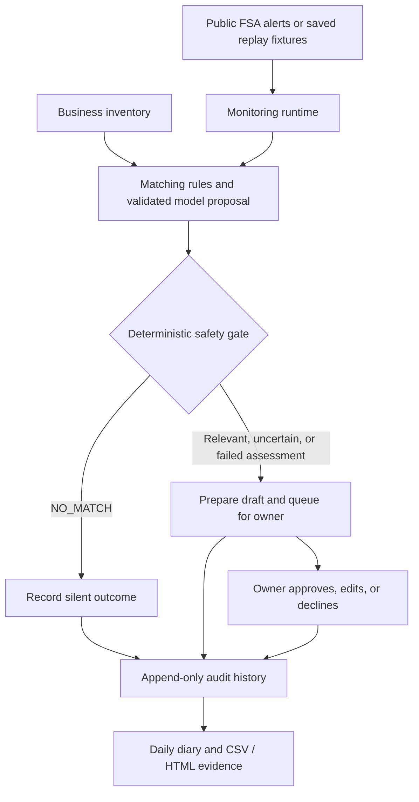

# AllerGuard

**Quiet by design.**

AllerGuard helps small UK food businesses check food recalls against their own stock and ingredients. It brings relevant or uncertain matches to the owner, records why other alerts were handled silently, and brings recall decisions and the daily food-safety diary into one evidence trail.

Built for the **Agents for Humans** hackathon using AWS Strands Agents and Amazon Bedrock.

## Public demo

**[Try AllerGuard](https://allerguard-7se.pages.dev)**

No account or installation is required. The GitHub origin listed below was still
returning HTTP 404 when fetched logged-out on 14 September 2026 (the repository
is currently private). Do not treat clone instructions as public-judge access
until that URL opens without signing in.

1. Select **Start fresh demo**, then **Run replay demo**.
2. See five historical recalls assessed: **two handled silently and three sent for review**.
3. Approve, edit, or decline the pending decisions.
4. Open **Audit trail** to inspect the recorded outcomes, including the silent ones.
5. Use **Diary** to file and confirm a daily record, then try the evidence exports.

> The public site is a browser-only simulation using public recalls and a fictional café. It does not run the Python backend, call AWS, or send notifications. The local application and recorded AWS tests below provide separate evidence of the backend implementation.

## Why this project matters

A café owner needs to know whether a recall affects something they sell or use. Reading every alert takes time, while sending every alert to the owner creates noise. Missing batch details or an unfamiliar product name can also make the answer uncertain.

AllerGuard focuses on that decision: explain the connection to the business, keep uncertainty visible, and leave a record of what happened. The daily diary keeps those decisions alongside the owner's opening and closing confirmations.

## What AllerGuard does

| Feature | Purpose |
|---|---|
| Inventory-aware matching | Compare recalls with products, ingredients, allergens, and available batch details. |
| Conservative escalation | Send possible, likely, and confirmed matches for review. Escalate assessment failures too. |
| Action drafts | Prepare a stock-pull instruction, staff note, draft customer notice, and substitution guidance. |
| Owner decisions | Record approve, edit, or decline while retaining the original draft. |
| Daily diary | Prepare a record, link recall evidence, and wait for explicit owner confirmation. |
| Audit and export | Keep silent outcomes, escalations, decisions, and diary records available in CSV and HTML. |
| Repeat-poll protection | Track processed alert versions so later polls do not repeat completed work. |

Recording an approval does not remove stock or send a customer notice. It records the owner's choice; physical actions remain outside this implementation.

## How it works

The Python runtime coordinates retrieval, assessment, persistence, and progress tracking. Strands agents support model-based assessments and drafts. A separate code gate decides whether an assessment can remain silent.



The public Pages site illustrates this flow independently. The local FastAPI dashboard calls the Python runtime. The scheduled AWS proof used EventBridge, Lambda, and DynamoDB with fixed assessment proposals and notifications disabled.

## Safety by design

- **Code controls escalation.** Only an assessed `NO_MATCH` can remain silent. The safety gate contains no model call.
- **Models cannot lower the matching floor.** Model proposals are checked against inventory evidence and deterministic rules.
- **Uncertainty stays visible.** An unknown batch is not presented as a confirmed match or proof that stock is safe.
- **Records are added, not rewritten.** Conditional writes preserve the first stored decision and support safe retries. This is application-level append-only behaviour, not a claim of tamper-proof storage.
- **Tests cover missed matches and unnecessary escalation.** The labelled fixture set checks both. Passing it is not a guarantee for every future recall.

## Verification

These are recorded results, with each environment's scope kept explicit.

| Evidence | Result |
|---|---|
| Offline Python suite, 14 September 2026 | **434 passed**, 6 live Bedrock tests deselected, 3 third-party warnings. Ruff, format, MyPy (61 files) and `git diff --check` also passed. Node Pages tests: 5 passed. |
| Local owner workflow | Five assessments, two silent outcomes, three escalations; approve/edit/decline and replay tested with Moto storage. |
| Diary and export | 15 events before diary confirmation, 16 after confirmation; replay leaves the stored count unchanged. |
| Separate live Bedrock checks | Five labelled matcher fixtures and a separate action-drafter case passed. |
| Scheduled AWS cycle, 13 September 2026 | First unattended run processed five recalls and committed progress. The next run found zero new alerts. |
| AWS stored evidence | Eight audit events, three queued escalations, six ledger items including the progress marker, and one business row. |

The AWS cycle ran in `eu-west-2`; its EventBridge rule was disabled after the proof. It used real Lambda and DynamoDB, saved recall fixtures, fixed proposals, and no notifications. It did not test live Bedrock inside that scheduled cycle.

See the [scheduled-cycle guide](infra/cycle/README.md) and [audit storage guide](infra/audit/README.md) for deployment and persistence details.

## Run locally

Use **Python 3.12 or 3.13** (`requires-python` is `>=3.12,<3.14`) and Git. The following commands are for Windows PowerShell. AWS credentials are not needed for the local demo. This audit used the repository `.venv` on Python 3.12.10.

```powershell
git clone https://github.com/Ella-Afonso/AllerGuard.git
cd AllerGuard
py -3.12 -m venv .venv
```

Install the application and development dependencies listed in `pyproject.toml`. The development dependencies include Moto, which provides local AWS emulation:

```powershell
.\.venv\Scripts\python.exe -m pip install --upgrade pip
.\.venv\Scripts\python.exe -c "import subprocess, sys, tomllib; p=tomllib.load(open('pyproject.toml','rb'))['project']; subprocess.check_call([sys.executable,'-m','pip','install',*p['dependencies'],*p['optional-dependencies']['dev']])"
```

Start the dashboard from the repository folder:

```powershell
.\.venv\Scripts\python.exe -m scripts.serve_dashboard
```

Open **http://127.0.0.1:8000**, start a demo session, and run the replay. The local application uses the real Python workflow with simulated model proposals and notifications. Its Moto history is lost when the process restarts.

To generate the cycle and diary evidence from the terminal:

```powershell
.\.venv\Scripts\python.exe -m scripts.demo_cycle --owner-choices simulated
.\.venv\Scripts\python.exe -m scripts.demo_diary --date 2026-09-13 --owner-confirmation simulated
```

Reports and traces are written to `artifacts/`. The diary command also creates a CSV export. These commands use fictional business data and do not call AWS.

## Run the checks

```powershell
.\.venv\Scripts\python.exe -m pytest -q -rs -m "not live_bedrock"
.\.venv\Scripts\python.exe -m ruff check src tests scripts
.\.venv\Scripts\python.exe -m ruff format --check src tests scripts
.\.venv\Scripts\python.exe -m mypy src
git diff --check
```

The test command explicitly excludes paid live Bedrock tests. The recorded 434-test result above is a dated baseline, not a live CI status badge.

## Technology and repository

**Python 3.12 · AWS Strands Agents · Amazon Bedrock · DynamoDB · Lambda · EventBridge · FastAPI · Jinja2 · Pydantic · Moto · pytest · Ruff · MyPy · Cloudflare Pages**

| Path | Contents |
|---|---|
| `src/agents/` | Strands agent prompts and wiring |
| `src/domain/` and `src/safety/` | Data models, matching rules, and deterministic gate |
| `src/tools/` | FSA, storage, audit, and notification integrations |
| `src/runtime/` and `src/api/` | Workflow coordination and dashboard API |
| `web/` | Local dashboard templates and assets |
| `pages-demo/` | Standalone public browser demonstration |
| `fixtures/` and `tests/` | Replay data and automated checks |
| `scripts/` | Local demos and setup utilities |
| `infra/` | AWS templates and operator guides |

## Current limitations

Live SES/SNS delivery and inbox receipt remain unverified. The complete product has not been deployed to AgentCore; the earlier AgentCore hello-agent proof was a separate, smaller deployment. Live FSA polling in the scheduled cycle and live supervisor delegation remain outside the recorded proof.

Menu extraction, automatic stock actions, and customer-message execution are not implemented. External delivery is not guaranteed exactly once. The diary and exports support review; they do not certify food-safety compliance.

## Data, attribution, and licence

The demo café and its inventory are fictional. Historical recall fixtures use public information from the **UK Food Standards Agency** and contain public sector information licensed under the [Open Government Licence v3.0](https://www.nationalarchives.gov.uk/doc/open-government-licence/version/3/).

The project code is available under the **MIT Licence**. See [LICENSE](LICENSE).
