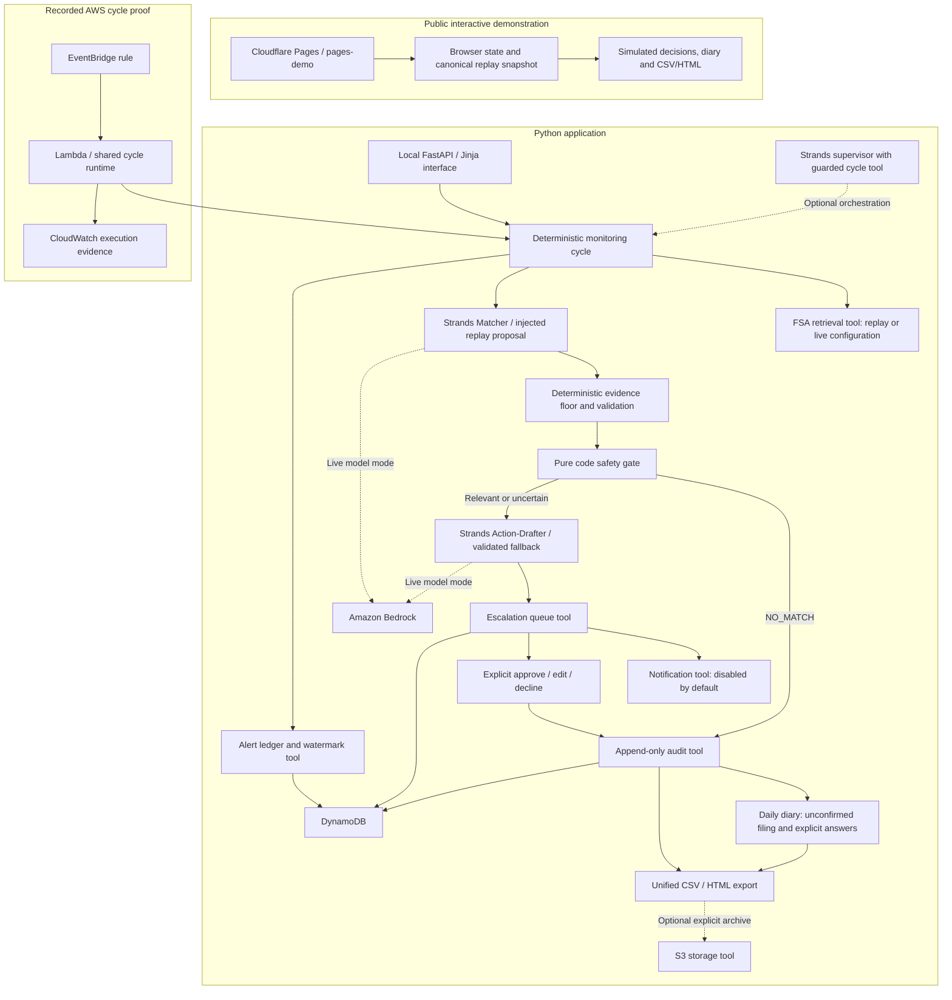

# AllerGuard architecture

This diagram distinguishes the implemented workflow from the public simulation and the AWS proofs. It does not claim that opening the public website invokes AWS.

## What was verified

- **Public interface:** a separate browser simulation; no credentials, AWS calls or persistent backend. Its five replay outcomes are generated from the canonical Python fixtures and injected proposals.
- **Python workflow:** the same processing boundaries support replay and live sources. Offline integration tests use Moto and simulated proposals/notifications. Only the deterministic runtime commits the watermark after successful processing.
- **AWS scheduled cycle:** recorded on 13 September 2026 using Lambda, EventBridge and real DynamoDB. Five replay alerts produced two silent assessments and three queued reviews; a later poll was empty with an unchanged watermark. The two recorded invocations were 10 minutes apart (22:00:27 then 22:10:28 UTC). The current template uses `rate(15 minutes)` and default DISABLED. The rule was disabled afterward. See [the recorded proof](../infra/cycle/README.md).
- **Strands and Bedrock:** individual Matcher and Action-Drafter live tests were recorded separately. They are not evidence of live model delegation throughout the scheduled cycle.
- **AgentCore:** an earlier hello-agent deployment ran unattended. Full product attachment and both production schedules are still open.
- **S3:** explicit archive/read-back code is tested with fakes. No live fixture mirror was created during this close-out.

## Boundaries that matter

The model proposes; code validates evidence and decides whether to escalate. Only an assessed `NO_MATCH` can stay silent. Matcher errors are escalated. Every outcome must leave audit evidence; a failed audit write cannot be reported as successful processing.

Owner choices record decisions. They do not remove stock or send customer notices. Diary preparation does not certify that opening or closing tasks were performed. The original diary filing remains unchanged when a separate confirmation is recorded.

Network and AWS effects belong in `src/tools/`. The public browser simulation is isolated from that workflow. S3 archival is optional and is not an alternative audit ledger or a claim of tamper-proof storage.
