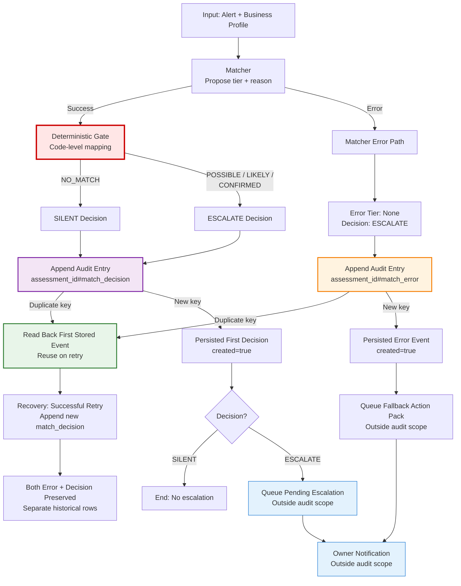
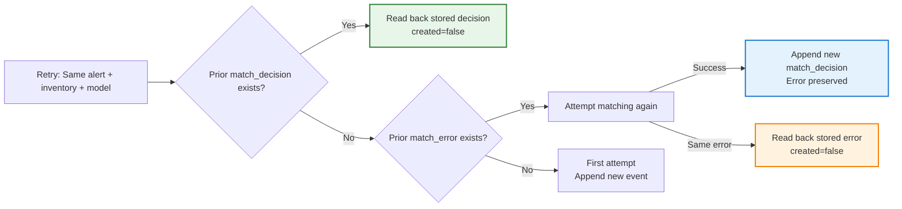

# AllerGuard audit table — operator guide

The audit integration provides durable persistence for recall assessment outcomes. Every decision—silent triages, escalations, matcher failures, and owner choices—produces an immutable audit row. The deterministic safety gate maps confidence tiers to silent-versus-escalate decisions using pure code, not model discretion. Audit persistence is the evidence boundary that makes the system's silence trustworthy and its escalations accountable.

This guide documents table provisioning, runtime permissions, idempotency contracts, and verified behaviour. It does not itself deploy the supervisor, send notifications, record owner approvals, advance the alert-ledger watermark, or execute stock or customer actions. Those orchestration responsibilities belong to `src/runtime/cycle.py`, `src/runtime/approve.py`, and related components, which consume this audit boundary.

## Why the audit boundary matters

AllerGuard monitors food recalls for small businesses that lack compliance staff. An autonomous system that mostly acts silently requires a complete, auditable record to be trustworthy:

**Every outcome needs evidence.** Environmental Health inspectors and legal investigations require timestamped records of what was monitored, what was dismissed as irrelevant, and what actions were taken. The audit trail is the artefact an owner hands an inspector.

**A silent result must be distinguishable from a missing result.** If the system triages an alert as `NO_MATCH` and logs it silently, that decision is recorded with a reason. Silent does not mean invisible—it means "handled without interrupting the owner, and here's why."

**Errors must remain visible.** If the matcher fails to assess an alert, the system escalates for human review and records the error. A later successful retry appends a decision without erasing the failure. The historical error row proves the system did not silently drop the alert.

**A retry must not overwrite the original decision.** Assessment idempotency uses conditional `PutItem` to ensure the first decision wins. Duplicate keys read back the original row; changed inputs produce a new assessment identity and a new row. Audit storage is append-only at the application boundary.

**Operators need to inspect what the system recorded.** The audit table supports consistent queries by business, ordered by timestamp. Export to CSV and HTML makes the complete history portable for inspection, legal disclosure, or regulatory review.

This boundary separates probabilistic judgment (the matcher's confidence tier) from guaranteed behaviour (the deterministic gate's silent/escalate mapping and durable storage). It is the single most important design choice for making autonomous food-safety monitoring credible.

## Verification status

| Component | Status | Evidence |
|---|---|---|
| **Offline Moto tests** | Verified | `tests/test_audit.py` (20 cases), `tests/test_process_alert.py` (27 cases), `tests/test_audit_demo.py`. Conditional `PutItem`, duplicate protection, identity-field matching, separate-process persistence, error/recovery coexistence, pagination, tenant isolation. Moto storage is ephemeral; data disappears when the demo process exits. |
| **Live DynamoDB audit-tool verification** | Verified separately (2026-09-10) | Real table `allerguard-audit` in `eu-west-2`. Dedicated assumed role `allerguard-audit-runtime` for scoped verification only (not attached to production compute). Synthetic append/read via `src/tools/audit.py`, duplicate protection (`created=false` on retry), separate-process persistence, and preservation of `#match_error` + `#match_decision` rows for one assessment identity. Verification inputs and outputs gitignored under `artifacts/step8-live-verification/`. Operator guide: this document. |
| **Live `process_alert` → DynamoDB** | Not verified | The offline Moto demo and live audit-tool checks are separate evidence. Live end-to-end `process_alert` writing to real DynamoDB through the complete runtime has not been executed. |
| **Live Bedrock end-to-end execution** | Not verified | Live matcher verification (five labelled fixtures, 2026-09-10) exercised the Bedrock model separately. Live Bedrock → audit → queue integration on real AWS has not been verified. |
| **AgentCore production deployment** | Not verified | The audit table and runtime IAM policy are prepared. AgentCore deployment of the full runtime with production identity wiring remains incomplete. |
| **Supervisor, watermark, notifications, approvals, dashboard** | Offline verified only | The deterministic monitoring cycle (`src/runtime/cycle.py`), escalation queue (`src/tools/escalation_queue.py`), owner approval path (`src/runtime/approve.py`), daily diary (`src/runtime/daily_diary.py`), and local dashboard (`src/api/app.py`) run end-to-end using Moto and injected proposals. Live SES/SNS delivery, inbox receipt, AWS Lambda scheduling, and production supervisor attachment remain unverified. |

This guide documents what the audit integration **is** (append-only DynamoDB persistence with conditional writes) and what it has been verified to do (offline Moto tests covering 47 audit/process cases; live audit-tool append/read with synthetic records). It does not claim full production deployment, live notification delivery, or exactly-once external guarantees.

## Scope diagram

The audit boundary sits between the deterministic gate and the escalation queue. It persists decisions but does not send notifications, record owner choices, or advance the alert watermark.



**Within audit scope (this guide):**
- Conditional `PutItem` for `#match_decision` and `#match_error` events.
- Duplicate-key read-back on retry.
- Identity-field validation.
- Consistent `GetItem` and `Query`.

**Outside audit scope (other components):**
- Escalation queue writes (`src/tools/escalation_queue.py`).
- Owner notification (`src/runtime/notification.py`).
- Approval recording (`src/runtime/approve.py`).
- Alert-ledger watermark commits (`src/tools/alert_ledger.py`).
- Daily diary filing (`src/runtime/daily_diary.py`).

The audit table also stores diary records (`#diary_filed`, `#diary_confirmed`) and decision records (`#decision`, `#escalation_queued`). Those events share the same append-only table but are consumed by separate runtimes. This guide focuses on the matcher → gate → audit flow.

## Table design

The audit table uses a simple two-key schema with on-demand billing and deletion protection. Configuration is read from environment variables with sensible defaults.

| Property | Value |
|---|---|
| **Default table name** | `allerguard-audit` |
| **Default region** | `eu-west-2` |
| **Partition key** | `business_id` (String) — supports multi-tenant isolation and efficient queries per business |
| **Sort key** | `entry_id` (String) — format: `{assessment_id}#{event}` where event is `match_decision`, `match_error`, `escalation_queued`, `decision`, `diary_filed`, or `diary_confirmed` |
| **Billing mode** | `PAY_PER_REQUEST` (on-demand) — no provisioned throughput; charged per request |
| **Deletion protection** | Enabled when created via `ensure_audit_table()` — protects the table from accidental deletion; does not make individual items immutable |
| **TTL** | None — no automatic expiration; records persist indefinitely |
| **Indexes** | None — queries use the partition key only; sort by timestamp in application code after retrieval |
| **Attributes** | Standard DynamoDB attributes (not predefined): `timestamp`, `alert_id`, `tier`, `decision`, `reason`, `error_type`, `policy_version`, `model_id`, `mode`, `candidate_ids`, `matched_items`, `draft_source`, and others. See `src/domain/models.py` for complete schema. |

The table is created with deletion protection enabled but without WORM (Write Once Read Many) enforcement, table-level locking, or item-level immutability controls beyond the application's conditional writes. A principal with unrestricted `PutItem` permissions can overwrite rows outside this application's code path.

## Configuration

Audit persistence reads configuration from environment variables, with defaults suitable for development and verification. Production deployments should set these explicitly.

| Environment Variable | Meaning | Default | Required | Consumed By |
|---|---|---|---|---|
| `ALLERGUARD_DYNAMODB_TABLE_AUDIT` | Audit table name | `allerguard-audit` | No | `Settings.from_environment()` in `src/config.py`; passed to all audit functions via `settings` parameter |
| `AWS_REGION` | AWS region for DynamoDB client | `eu-west-2` | No | `Settings.from_environment()`; used by `boto3.resource("dynamodb", region_name=...)` |
| `AWS_PROFILE` | Named AWS CLI profile for local development | None | No (uses default credential chain if omitted) | boto3 credential resolution; not read by application code directly |

Additional configuration for other components (Bedrock model ID, notification mode, alert ledger table) is documented in the root README. This guide focuses only on the audit table settings.

**Region selection:** `eu-west-2` (Europe, London) was chosen for live verification. The application does not hard-code a region outside `src/config.py` defaults; operators can override via `AWS_REGION`.

**Table name customization:** Use a unique table name per environment (e.g., `allerguard-audit-dev`, `allerguard-audit-staging`) to prevent accidental cross-environment writes. The demo business `demo-cafe` is fictional; use distinct business IDs for isolated testing.

## Identity and permissions

The audit integration distinguishes between **operator permissions** (creating and validating the table) and **runtime permissions** (appending and reading audit entries). Separate identities with least-privilege policies prevent runtime code from deleting or modifying the table.

### Operator/provisioning identity

The operator identity provisions the table once during setup. Required actions:

```json
{
  "Version": "2012-10-17",
  "Statement": [
    {
      "Effect": "Allow",
      "Action": [
        "dynamodb:CreateTable",
        "dynamodb:DescribeTable"
      ],
      "Resource": "arn:aws:dynamodb:REGION:ACCOUNT_ID:table/TABLE_NAME"
    }
  ]
}
```

`ensure_audit_table()` creates the table if missing, waits until `ACTIVE`, validates the key schema, and returns without modifying deletion protection or billing mode on an existing table. Operators run this function once per environment; runtime identities never call `CreateTable`.

**Policy simulation:** Use `aws iam simulate-principal-policy` to verify the operator identity has `CreateTable` and `DescribeTable` before provisioning. This confirms permissions on paper but does not prove live table creation.

**Live verification requires real API calls:** Policy simulation alone is not sufficient. The verified live check (2026-09-10) called `ensure_audit_table()`, wrote synthetic rows via `append_audit_entry()`, and read them back via `get_audit_entry()` and `list_audit_entries()` under the scoped `allerguard-audit-runtime` assumed role.

### Runtime identity

The runtime identity appends audit entries and queries business history. It never creates, deletes, or modifies the table. Required actions:

```json
{
  "Version": "2012-10-17",
  "Statement": [
    {
      "Sid": "AuditRuntimeReadAndAppend",
      "Effect": "Allow",
      "Action": [
        "dynamodb:GetItem",
        "dynamodb:Query",
        "dynamodb:PutItem"
      ],
      "Resource": "arn:aws:dynamodb:REGION:ACCOUNT_ID:table/TABLE_NAME"
    },
    {
      "Sid": "DenyAuditRowMutationAndTableRemoval",
      "Effect": "Deny",
      "Action": [
        "dynamodb:UpdateItem",
        "dynamodb:DeleteItem",
        "dynamodb:BatchWriteItem",
        "dynamodb:PartiQLUpdate",
        "dynamodb:PartiQLDelete",
        "dynamodb:DeleteTable"
      ],
      "Resource": "arn:aws:dynamodb:REGION:ACCOUNT_ID:table/TABLE_NAME"
    }
  ]
}
```

**Allowed at runtime:**
- `GetItem` — consistent reads for duplicate-key detection (`get_audit_entry()`).
- `Query` — paginated business history (`list_audit_entries()`, `list_history()`).
- `PutItem` — conditional writes only (`append_audit_entry()`, `append_diary_record()`).

**Denied at runtime:**
- `UpdateItem`, `DeleteItem`, `BatchWriteItem` — prevent row mutation.
- `PartiQLUpdate`, `PartiQLDelete` — prevent SQL-like mutation.
- `DeleteTable` — prevent accidental table removal.
- `Scan` — not used; queries use the partition key.
- `CreateTable`, `DescribeTable` — provisioning actions belong to operators only.

The explicit `Deny` statement in the runtime policy prevents even an administrator from accidentally granting mutation permissions through a broader policy. A principal with unrestricted `PutItem` (without the application's conditional expression) can still overwrite rows; IAM alone does not enforce item-level immutability.

**No exposed update or delete functions:** The codebase defines no `update_audit_entry()` or `delete_audit_entry()` functions. Tests assert these names do not exist (`tests/test_audit.py`). This is application-enforced append-only behaviour, not WORM compliance storage.

**Scoped verification role:** The live verification (2026-09-10) used a dedicated assumed role `allerguard-audit-runtime` with the runtime policy above. This role is **not** attached to AgentCore, Lambda, or other production compute. It was created for isolated verification only. Production deployment requires separate runtime identity wiring, which remains unverified.

## Append-only behaviour and its limits

AllerGuard audit entries are immutable at the application boundary through conditional `PutItem` writes. This section documents precisely what the application enforces and what it does not.

**Conditional `PutItem` contract:**
Every `append_audit_entry()` and `append_diary_record()` call uses:
```python
ConditionExpression="attribute_not_exists(#pk) AND attribute_not_exists(#sk)"
```
The write succeeds only if both `business_id` (partition key) and `entry_id` (sort key) are absent. If the key already exists, DynamoDB rejects the write with `ConditionalCheckFailedException`.

**First-write-wins behaviour:**
On duplicate-key conflict, the application reads back the existing row via `get_audit_entry()` or `get_diary_record()`. If identity fields match (assessment ID, event type, alert ID, policy version, model ID, mode), the existing row is returned as `AuditAppendResult(entry=existing, created=False)`. The caller receives a receipt indicating reuse, not creation.

**Identity-field validation:**
If a duplicate key has incompatible identity fields (different assessment ID, model, or policy version), `AuditPersistenceError` is raised. This prevents accidental key collisions between unrelated assessments. Output fields (timestamp, reason prose) may differ on retry; identity fields must match exactly.

**Error and recovery coexistence:**
- A matcher error writes `{assessment_id}#match_error` with `tier=None`, `decision=ESCALATE`, and `error_type` populated.
- A later successful retry writes `{assessment_id}#match_decision` with `tier`, `floor_tier`, and `reason` populated.
- Both rows persist. The error is not deleted or overwritten. The complete history shows the system experienced a failure and recovered.

**Repeated identical errors deduplicate:**
If the matcher fails twice with the same error type for the same assessment identity, the second error read-backs the first `#match_error` row. Audit idempotency prevents unbounded error accumulation; this is a decision ledger, not a per-attempt diagnostic log.

**What append-only does not guarantee:**

1. **Not WORM or tamper-proof compliance storage:** Deletion protection applies to the DynamoDB table, not individual items. The IAM `Deny` statement prevents `UpdateItem`/`DeleteItem` but does not block an unconditional `PutItem` outside this application. A principal with unrestricted `PutItem` permissions (no `ConditionExpression`) can overwrite any row. Administrators can also change policies. This is application-enforced append-only, not cryptographically verified immutability.
2. **Not atomic across multiple tables:** Audit writes and alert-ledger watermark commits use separate DynamoDB tables. If DynamoDB becomes unavailable between the audit write and the watermark commit, the watermark is withheld (the system re-processes on the next cycle). This prevents skipping alerts but does not guarantee atomic distributed transactions.

3. **Not protected against table deletion:** Deletion protection prevents accidental `DeleteTable` calls, but it can be disabled by an administrator. Use AWS Organizations SCPs, resource tagging policies, or separate accounts to enforce production immutability boundaries beyond this application.

**Honest representation:** The root README and this guide never describe the audit table as "tamper-proof", "immutable under all identities", "WORM-compliant", or "cryptographically verified". The accurate claim is: "application-enforced append-only storage through conditional `PutItem`; deletion protection enabled at table level; runtime IAM denies `UpdateItem`/`DeleteItem`; a privileged principal outside this code path can still overwrite rows."

## Idempotency and event keys

Assessment identity is a SHA-256 hash over canonical JSON of the alert content, business inventory, model ID, proposal mode, and policy version. Execution time and model output are excluded. Unchanged inputs produce the same assessment ID; changed inputs produce a new ID and a new audit row.

**Assessment identity inputs:**
- Alert ID, title, modified timestamp (UTC-normalized), full content
- Business ID, inventory items (products, ingredients, allergens, categories, batches)
- Model ID (Bedrock inference profile or `injected-proposal`)
- Proposal mode (`BEDROCK` or `INJECTED`)
- Policy version (currently `matcher-gate-v1`)

**What changes the assessment ID:**
- New alert version (FSA updates the modified timestamp or content)
- Inventory change (owner adds/removes products, ingredients, or allergens)
- Model change (switch Bedrock model or upgrade policy version)
- Mode change (live Bedrock vs. injected test proposal)

**What does not change the assessment ID:**
- Execution timestamp (current time when `process_alert` runs)
- Model output (the tier, reason, candidates returned by the matcher)
- Retry count (re-running unchanged inputs reuses the first stored decision)

**Event key patterns:**

| Event Type | Sort Key Format | Description |
|---|---|---|
| Successful assessment | `{assessment_id}#match_decision` | Tier, floor tier, decision, reason, candidates, matched items populated |
| Matcher error | `{assessment_id}#match_error` | Tier null, error type populated, decision always `ESCALATE` |
| Escalation queued | `{assessment_id}#escalation_queued` | Links to match event; includes drafted action pack and draft source |
| Owner decision | `{assessment_id}#decision` | Owner approve/edit/decline choice; immutable first-write-wins |
| Daily diary filed | `{business_id}#{date}#diary_filed` | Deterministic daily record; different key pattern |
| Diary confirmed | `{business_id}#{date}#diary_confirmed` | Owner explicit opening/closing confirmation |

**Retry behaviour:**



**What idempotency does not guarantee:**
- **Not exactly-once external notification:** The audit write and the notification delivery (SES/SNS) are separate operations. If notification succeeds but the process crashes before recording the receipt, a retry may re-notify. The serial read-before-send check in `src/runtime/notification.py` reduces duplicate notifications but does not eliminate them in the face of network partitions or concurrent callers.
- **Not protection against inventory changes between retries:** If the owner updates inventory and immediately retries, the new inventory produces a new assessment ID and a new audit row. The old assessment remains in history; it is not retroactively invalidated.

## Error handling

Audit persistence failures propagate as `AuditPersistenceError` and prevent successful acknowledgment. The caller must surface the failure, continue processing other alerts, and withhold watermark advancement to ensure the failed alert is retried.

**When DynamoDB is unavailable:**
- `get_audit_entry()` raises `AuditPersistenceError("Audit read failed; processing cannot be acknowledged.")`.
- `append_audit_entry()` raises `AuditPersistenceError("Audit append failed; decision was not acknowledged.")` for write failures.
- `list_audit_entries()` raises `AuditPersistenceError("Audit history could not be read completely.")` for query failures.

**Wrapped exceptions:**
All `BotoCoreError`, `ClientError`, `ValidationError`, and `TypeError` from boto3 or Pydantic are caught and re-raised as `AuditPersistenceError` with a clear message. The original exception is chained (`from error`). This prevents `process_alert()` from silently swallowing storage outages inside the matcher-error boundary.

**Successful receipt requires persistence:**
`process_alert()` returns `ProcessedAlert` only after `append_audit_entry()` succeeds. If audit append fails, the exception propagates to the caller. The caller (typically the monitoring cycle in `src/runtime/cycle.py`) must:
1. Log the audit outage.
2. Continue processing other alerts (one bad alert must not drop the rest of the batch).
3. **Withhold the alert-ledger watermark commit** until all outcomes are persisted.

**Watermark withholding prevents alert loss:**
If DynamoDB becomes unavailable mid-batch, some assessments may succeed and others may fail. The watermark remains at the prior position. On the next cycle, the system re-processes the entire batch. Successful assessments reuse their stored decisions (`created=false`); failed assessments retry from scratch. This ensures no alert is skipped due to a transient outage.

**Error decision hint:**
`AuditPersistenceError` includes `decision = GateDecision.ESCALATE` as a hint for upstream handling. This is not proof that a human was notified; it signals that the system could not store the decision and the caller should treat the alert as requiring review.

**Current runtime behaviour:**
The offline monitoring cycle (`src/runtime/cycle.py`) and the dashboard (`src/api/app.py`) surface audit errors in application logs. The cycle withholds the watermark on any audit failure. Live AWS scheduling and exactly-once escalation retry logic remain unverified.

## Operator setup

Provision the audit table using an authenticated AWS CLI session with operator-level permissions. These commands assume Python 3.12, an activated virtual environment at `.\.venv`, and the repository root as the working directory.

### Set AWS environment variables

```powershell
$env:AWS_PROFILE = 'allerguard-dev'
$env:AWS_REGION = 'eu-west-2'
$env:ALLERGUARD_DYNAMODB_TABLE_AUDIT = 'allerguard-audit'
```

Replace `allerguard-dev` with your configured AWS CLI profile name. These environment variables select a profile and region; they do not sign you in. Verify the active identity:

```powershell
aws sts get-caller-identity
```

Expected output includes `UserId`, `Account`, and `Arn`. If the command fails with "Unable to locate credentials", configure the AWS CLI profile or export credentials first.

### Provision the audit table

```powershell
.\.venv\Scripts\python.exe -c "from src.tools.audit import ensure_audit_table; ensure_audit_table()"
```

Signature: `ensure_audit_table(settings: Settings | None = None) -> None`

This function:
1. Checks whether the table exists via `DescribeTable`.
2. Creates the table if missing, with `PAY_PER_REQUEST` billing and deletion protection enabled.
3. Waits until the table reaches `ACTIVE` status.
4. Validates the key schema (partition: `business_id`, sort: `entry_id`).
5. Raises `AuditPersistenceError` if the schema is incompatible.

**Idempotent:** Safe to call multiple times. If the table already exists with the correct schema, the function validates and returns without recreating it. Deletion protection and billing mode are **not** modified on an existing table.

**Expected output:** No output on success (function returns `None`). If the table is created, boto3 may log `Creating table allerguard-audit...`. If the table already exists, the function validates silently.

### Verify table status

```powershell
aws dynamodb describe-table --table-name allerguard-audit --region eu-west-2 --query 'Table.[TableName,TableStatus,KeySchema]'
```

Expected output:
```json
[
  "allerguard-audit",
  "ACTIVE",
  [
    {"AttributeName": "business_id", "KeyType": "HASH"},
    {"AttributeName": "entry_id", "KeyType": "RANGE"}
  ]
]
```

Confirm `TableStatus` is `ACTIVE` and `KeySchema` matches the expected partition and sort keys.

### Check deletion protection

```powershell
aws dynamodb describe-table --table-name allerguard-audit --region eu-west-2 --query 'Table.DeletionProtectionEnabled'
```

Expected output: `true` (if the table was created via `ensure_audit_table()`).

## Inspecting rows

The AWS Console and CLI provide read-only inspection of stored audit entries. Use `Query` instead of `Scan` when the partition key (business ID) is known.

### AWS Console inspection

1. Open the AWS Console and navigate to **DynamoDB → Tables**.
2. Select the region: `eu-west-2`.
3. Choose the table: `allerguard-audit` (or your configured name).
4. Click **Explore table items**.
5. Select **Query** (not Scan).
6. **Partition key:** Enter `demo-cafe` (the fictional demo business ID).
7. Click **Run**.

Sort keys follow the pattern `{assessment_hash}#match_decision`, `{assessment_hash}#match_error`, `{assessment_hash}#escalation_queued`, `{assessment_hash}#decision`, or `{date}#diary_filed`. Timestamps are stored as ISO 8601 strings with timezone (`2026-09-13T21:14:36.123456+00:00`). The application code orders results by `(timestamp, entry_id)` after retrieval; DynamoDB does not guarantee timestamp order without a sort key prefix.

### CLI query

```powershell
aws dynamodb query `
  --table-name allerguard-audit `
  --region eu-west-2 `
  --key-condition-expression "business_id = :bid" `
  --expression-attribute-values '{":bid":{"S":"demo-cafe"}}' `
  --consistent-read `
  --max-items 10
```

Expected output: JSON array of items under `"Items"`. Each item includes `business_id`, `entry_id`, `timestamp`, `alert_id`, `tier`, `decision`, `reason`, and other attributes.

### Python read command

```powershell
.\.venv\Scripts\python.exe -c "from src.tools.audit import list_audit_entries; from src.config import Settings; entries = list_audit_entries('demo-cafe', Settings.from_environment()); print(f'{len(entries)} audit entries'); [print(f'{e.timestamp} {e.event.value} {e.decision.value} {e.alert_id}') for e in entries[:5]]"
```

This command queries all pages for `demo-cafe`, validates and deserializes each row, sorts by timestamp, and prints the first five entries. Expected output depends on whether any audit entries exist for that business ID. For a fresh table: `0 audit entries`.

## Offline demonstration

The offline demonstration uses Moto (in-memory DynamoDB emulation) and injected assessment proposals. No real AWS API calls occur. Data disappears when the demo process exits.

### Run the full offline scenario

From the repository root with `.\.venv` activated:

```powershell
.\.venv\Scripts\python.exe -m scripts.demo_gate_audit --scenario full --repeat 2 --report artifacts/audit-full.html
```

**What this demonstrates:**
- Five labelled FSA recall fixtures processed through `process_alert()`.
- Deterministic gate maps tiers to silent/escalate decisions.
- Conditional audit writes (first pass creates rows; second pass reuses them).
- Separate `#match_decision` and `#escalation_queued` events for escalated alerts.
- Read-back via `list_audit_entries()` and `summarize_audit_entries()`.

**Expected persisted counts (after pass 2):**

| Metric | Value |
|---|---|
| Stored audit events | 8 (5 match decisions + 3 queued events) |
| Distinct assessments | 5 |
| Silent decision events | 2 (`nomatch_1`, `nomatch_2` fixtures) |
| Requires-review decision events | 3 (walnut, mustard, Doritos fixtures) |
| Assessment error events | 0 (successful matching path) |

Pass 2 reuses all eight stored event keys; totals do not increase. Open `artifacts/audit-full.html` in a browser for a read-only evidence snapshot.

### Run the failure-and-recovery scenario

```powershell
.\.venv\Scripts\python.exe -m scripts.demo_gate_audit --scenario failure --repeat 2 --report artifacts/audit-recovery.html
```

**What this demonstrates:**
- Simulated matcher error on pass 1 (tier null, error type `ValueError`).
- `#match_error` event with `decision=ESCALATE` and fallback action draft.
- Successful retry on pass 2 appends `#match_decision`.
- Both error and decision rows persist; recovery does not erase the error.

**Expected persisted counts (after pass 2):**

| Metric | Value |
|---|---|
| Stored audit events | 3 (`#match_error` + `#escalation_queued` + `#match_decision`) |
| Distinct assessments | 1 |
| Assessment error events | 1 (preserved) |
| Requires-review decision events | 1 (recovery added a decision) |

The HTML report lists stored audit events and distinct assessments separately. Event count is not the number of alerts processed; "requires review" does not mean the owner was notified (the offline demo uses simulated notification acceptance).

**Moto persistence note:** Moto storage exists only for the running Python process. Restarting the demo script starts with an empty table. The HTML output is a read-only snapshot from `list_audit_entries()`, not an approval interface.

## Live audit-tool verification

The live verification (2026-09-10) exercised real DynamoDB API operations under a scoped assumed role. This section documents what was genuinely verified and what was not.

### What was verified on live AWS

| Operation | Verified | Evidence |
|---|---|---|
| **Table provisioning** | Yes | `ensure_audit_table()` created `allerguard-audit` in `eu-west-2`; `DescribeTable` confirmed `ACTIVE` status and correct key schema. |
| **Synthetic append** | Yes | `append_audit_entry()` wrote fictional audit rows with fictional business `demo-cafe-verification` under assumed role `allerguard-audit-runtime`. |
| **Duplicate protection** | Yes | Retry with identical assessment identity returned `created=false` and read back the first stored row. |
| **Identity-field validation** | Yes | Retry with incompatible identity fields (different policy version) raised `AuditPersistenceError`. |
| **Separate-process persistence** | Yes | Second Python process with separate boto3 session queried and deserialized rows written by the first process. |
| **Error/recovery coexistence** | Yes | Wrote `#match_error`, then `#match_decision` for same assessment ID. Both rows persisted; query returned both events. |
| **Consistent reads** | Yes | `get_audit_entry()` used `ConsistentRead=True`; no eventual-consistency delays observed. |

**IAM identity used:** Dedicated assumed role `allerguard-audit-runtime` with the runtime policy documented above (GetItem, Query, PutItem allowed; UpdateItem/DeleteItem/DeleteTable denied). This role is **not** attached to AgentCore, Lambda, or other production compute. It was created for isolated verification only and may be deleted after verification.

**Verification inputs and outputs:** Synthetic assessment rows, identity collision tests, and read-back results were saved under `artifacts/step8-live-verification/` (gitignored). These files are not published to GitHub. The verification used fictional business IDs (`demo-cafe-verification`, `test-business-synthetic`) and synthetic alert IDs (`synthetic-live-test-001`, etc.). No real business or personal data was written.

**Verification limitations:** The live audit-tool check verified `src/tools/audit.py` append/read operations only. It did **not** verify:
- Live `process_alert()` → DynamoDB integration.
- Live Bedrock matcher invocation from `process_alert()`.
- AgentCore production deployment with runtime identity wiring.
- Supervisor orchestration or alert-ledger watermark commits.
- Escalation queue writes, owner notification, or approval recording.
- Dashboard actions or scheduled Lambda invocation.

**Separate from live matcher verification:** The live Bedrock matcher verification (2026-09-10, five labelled fixtures) exercised the matcher separately. It wrote to a local manifest file, not to DynamoDB. The audit-tool verification used injected proposals only. Live Bedrock → audit → queue integration on real AWS has not been verified.

### Reproducing live verification (optional)

Live verification writes persistent rows and incurs DynamoDB charges. Use a scoped runtime role and synthetic data only.

**Prerequisites:**
1. Provisioned audit table (`ensure_audit_table()`).
2. Scoped runtime role with GetItem, Query, PutItem (template: `infra/audit/runtime-policy.example.json`).
3. Temporary assumed-role credentials exported as `AWS_ACCESS_KEY_ID`, `AWS_SECRET_ACCESS_KEY`, `AWS_SESSION_TOKEN`.

**Run the live demo mode:**

```powershell
$env:ALLERGUARD_DYNAMODB_TABLE_AUDIT = 'allerguard-audit'
$env:AWS_REGION = 'eu-west-2'
.\.venv\Scripts\python.exe -m scripts.demo_gate_audit --live --scenario headline --report artifacts/audit-live.html
```

**Warning:** This writes persistent DynamoDB rows under business ID `demo-cafe`. Use `--business-id demo-cafe-test` to isolate verification data. Do not run against production tables or shared business IDs without explicit approval. Synthetic records can be removed manually via the AWS Console or CLI `DeleteItem` if needed (deletion is denied by the runtime policy but allowed by an operator identity).

## Troubleshooting

This section documents common audit-integration issues, their symptoms, and fastest remedies.

### Missing AWS credentials

**Symptom:** `NoCredentialsError: Unable to locate credentials` or `botocore.exceptions.NoCredentialsError`.

**Check:** Run `aws sts get-caller-identity`. If this fails, AWS CLI is not configured.

**Remedy:** Configure the AWS CLI profile:
```powershell
aws configure --profile allerguard-dev
```
Or export temporary credentials:
```powershell
$env:AWS_ACCESS_KEY_ID = 'AKIA...'
$env:AWS_SECRET_ACCESS_KEY = '...'
$env:AWS_SESSION_TOKEN = '...'
```

### Wrong region

**Symptom:** `ResourceNotFoundException: Requested resource not found` when table exists in a different region.

**Check:** Verify the configured region matches the table's actual region:
```powershell
aws dynamodb describe-table --table-name allerguard-audit --region eu-west-2
aws dynamodb describe-table --table-name allerguard-audit --region us-east-1
```

**Remedy:** Set `AWS_REGION` explicitly:
```powershell
$env:AWS_REGION = 'eu-west-2'
```

### Wrong table name

**Symptom:** `ResourceNotFoundException: Requested resource not found: Table: allerguard-audit`.

**Check:** List existing tables:
```powershell
aws dynamodb list-tables --region eu-west-2
```

**Remedy:** If the table name is different, set `ALLERGUARD_DYNAMODB_TABLE_AUDIT`:
```powershell
$env:ALLERGUARD_DYNAMODB_TABLE_AUDIT = 'your-actual-table-name'
```
Or provision the expected table: `.\.venv\Scripts\python.exe -c "from src.tools.audit import ensure_audit_table; ensure_audit_table()"`.

### Incompatible table schema

**Symptom:** `AuditPersistenceError: Audit table has an incompatible key schema.`

**Check:** Verify the key schema:
```powershell
aws dynamodb describe-table --table-name allerguard-audit --region eu-west-2 --query 'Table.KeySchema'
```

**Expected:** Partition key `business_id` (HASH), sort key `entry_id` (RANGE).

**Remedy:** If the schema is incompatible, delete the table (requires deletion protection to be disabled first) and recreate:
```powershell
aws dynamodb update-table --table-name allerguard-audit --no-deletion-protection-enabled --region eu-west-2
aws dynamodb delete-table --table-name allerguard-audit --region eu-west-2
.\.venv\Scripts\python.exe -c "from src.tools.audit import ensure_audit_table; ensure_audit_table()"
```
**Warning:** Deleting the table destroys all stored audit history. Only delete development or test tables. Never delete shared or production tables without explicit approval and backup.

### Access denied

**Symptom:** `AccessDeniedException: User: arn:aws:iam::123456789012:user/alice is not authorized to perform: dynamodb:PutItem on resource: arn:aws:dynamodb:eu-west-2:123456789012:table/allerguard-audit`.

**Check:** Verify the IAM identity has the required runtime permissions:
```powershell
aws iam simulate-principal-policy `
  --policy-source-arn arn:aws:iam::123456789012:user/alice `
  --action-names dynamodb:GetItem dynamodb:Query dynamodb:PutItem `
  --resource-arns arn:aws:dynamodb:eu-west-2:123456789012:table/allerguard-audit
```

**Remedy:** Attach the runtime policy to the IAM user, role, or group. Template: `infra/audit/runtime-policy.example.json`. Replace `REGION`, `ACCOUNT_ID`, and `TABLE_NAME` placeholders before attaching.

### Conditional write conflict

**Symptom:** `ConditionalCheckFailedException: The conditional request failed`.

**Expected behaviour:** This is not an error if the application returns `created=false`. Duplicate keys are intentionally rejected; the application reads back the first stored row.

**Unexpected behaviour:** If the exception propagates to the caller without read-back, check that `append_audit_entry()` catches `ConditionalCheckFailedException` and calls `get_audit_entry()` for validation.

**Remedy:** No action required if reuse is logged correctly. If the exception propagates unexpectedly, verify the application code is up to date and `append_audit_entry()` includes the read-back path.

### DynamoDB table not ACTIVE

**Symptom:** `ResourceInUseException: Table is being created` or `ValidationException: Provided TableStatus is not ACTIVE`.

**Check:** Query the table status:
```powershell
aws dynamodb describe-table --table-name allerguard-audit --region eu-west-2 --query 'Table.TableStatus'
```

**Remedy:** Wait until status is `ACTIVE`. `ensure_audit_table()` includes a waiter; if the function returns without error, the table is active. If table creation is stuck, check CloudTrail logs for errors or delete and recreate.

### Read or write failure

**Symptom:** `AuditPersistenceError: Audit append failed; decision was not acknowledged.` or `AuditPersistenceError: Audit read failed; processing cannot be acknowledged.`

**Check:** Test DynamoDB connectivity:
```powershell
aws dynamodb describe-table --table-name allerguard-audit --region eu-west-2
```
If the CLI command succeeds but the application fails, check Python dependencies:
```powershell
.\.venv\Scripts\python.exe -c "import boto3; print(boto3.__version__)"
```

**Remedy:** If DynamoDB is unavailable (service outage, network partition), wait and retry. The monitoring cycle withholds the watermark; alerts are re-processed on the next successful cycle. If boto3 is missing or incompatible, reinstall dependencies:
```powershell
.\.venv\Scripts\python.exe -m pip install --requirement requirements.txt
```

### Moto state disappearing after process exit

**Symptom:** Offline demo runs successfully, but restarting the script shows zero audit entries.

**Expected behaviour:** Moto storage is ephemeral. Each process starts with an empty in-memory table.

**Remedy:** This is not a bug. The offline demo is not durable storage. For persistent audit history, use real DynamoDB (live verification or production deployment).

## Security, privacy, and cost notes

**Use fictional or synthetic data only:** All audit verification and demonstrations use fictional business IDs (`demo-cafe`, `demo-cafe-verification`, `test-business-synthetic`) and synthetic alert IDs. The Walnut & Whisk Café is a fictional business. No real personal, health, or business information should be written to the audit table.

**Never commit credentials:** Do not commit AWS access keys, secret keys, session tokens, or local authentication files (`.aws/credentials`, `.aws/config`) to the repository. Use environment variables or AWS CLI profiles for local development. Temporary credentials should be exported to the session only, never hardcoded.

**Use a scoped runtime role:** Attach the runtime policy (`infra/audit/runtime-policy.example.json`) to a dedicated IAM role or user for application runtime. Do not grant broad `dynamodb:*` permissions. The explicit `Deny` statement in the policy prevents accidental escalation.

**Avoid broad operator permissions for runtime:** Operators who provision the table need `CreateTable` and `DescribeTable`. Runtime identities do not need these actions. Separate identities with least-privilege policies prevent runtime code from accidentally deleting or recreating the table.

**DynamoDB on-demand billing incurs charges:** The `PAY_PER_REQUEST` billing mode charges per API request (GetItem, Query, PutItem). Costs are low for development (typically cents per day) but can accumulate with high-volume production workloads. Monitor AWS Cost Explorer or set billing alarms.

**Remove or retain synthetic verification rows deliberately:** The live verification (2026-09-10) intentionally retained synthetic rows for inspection. These rows do not contain sensitive data but do consume storage. Operators can delete verification rows via the AWS Console or CLI if desired:
```powershell
aws dynamodb delete-item `
  --table-name allerguard-audit `
  --key '{"business_id":{"S":"demo-cafe-verification"},"entry_id":{"S":"synthetic-id#match_decision"}}' `
  --region eu-west-2
```
**Warning:** Deletion is denied by the runtime policy. Use an operator identity with unrestricted `DeleteItem` permissions.

**Do not delete shared tables without confirming the exact target:** If multiple environments share an AWS account, verify the table name and business IDs before deletion. Deleting the wrong table destroys audit history for other developers. Use separate accounts or distinct table names per environment (e.g., `allerguard-audit-dev`, `allerguard-audit-staging`).

**Audit history is evidence, not backups:** The audit table provides an evidence trail for regulatory inspection and legal disclosure. It does not replace point-in-time recovery, cross-region replication, or offsite backups. Enable DynamoDB Point-in-Time Recovery (PITR) for production tables if recovery from accidental deletion or corruption is required.

**Production deployment requires additional controls:** This guide documents the audit integration for development and verification. Production deployment should include:
- Separate AWS accounts or strict IAM boundaries per environment.
- CloudTrail logging for all DynamoDB API calls.
- DynamoDB Point-in-Time Recovery enabled.
- Monitoring and alerting for audit write failures.
- Periodic export to S3 or Glacier for long-term archival.
- Legal review of data retention policies and GDPR/privacy compliance.

None of these production controls are implemented or verified by the current integration.

## What this guide does not prove

This operator guide documents the audit table integration and its verified behaviour. It explicitly does **not** claim or prove the following:

**Live full application flow:** The offline Moto demo and live audit-tool verification are separate evidence. Live end-to-end `process_alert` writing to real DynamoDB through the complete runtime (matcher → gate → audit → queue → notification → approval → watermark) has not been executed on AWS.

**Live Bedrock end-to-end execution:** The live Bedrock matcher verification (2026-09-10) and the live audit-tool verification (2026-09-10) were completed separately. Live Bedrock invocation → audit write → queue write integration on real AWS has not been verified.

**AgentCore production attachment:** The audit table and runtime IAM policy are prepared. AgentCore deployment of the full runtime with production identity wiring (attaching the runtime policy to the AgentCore execution role) remains incomplete.

**Supervisor orchestration and watermark commits:** The deterministic monitoring cycle (`src/runtime/cycle.py`) and alert-ledger watermark logic (`src/tools/alert_ledger.py`) run end-to-end using Moto. Live AWS Lambda invocation, EventBridge scheduling, and production watermark commits remain unverified.

**Owner notification delivery or inbox receipt:** The notification boundary (`src/runtime/notification.py`) uses simulated provider acceptance in the offline demo. Live SES email sending, SNS topic publishing, and inbox receipt verification have not been completed.

**Owner approval and decision recording:** The approval path (`src/runtime/approve.py`) records approve/edit/decline choices through the real persistence boundary using Moto. Live dashboard actions writing to real DynamoDB, and end-to-end human-loop integration on AWS, remain unverified.

**Exactly-once external delivery:** The serial read-before-send check with conditional inserts reduces duplicate notifications but does not guarantee exactly-once delivery in the face of crashes, network partitions, or concurrent callers. This is application-level idempotency, not distributed-transaction atomicity.

**Tamper-proof or WORM compliance storage:** Append-only behaviour is enforced by the application's conditional `PutItem` writes and the runtime IAM `Deny` statement for `UpdateItem`/`DeleteItem`. Deletion protection applies to the table, not individual items. A principal with unrestricted `PutItem` permissions can overwrite rows outside this code path. Administrators can change policies. This is not cryptographically verified immutability or compliance-grade WORM storage.

**Production deployment, public hosting, or judge access:** The audit table is provisioned and verified on one AWS account (`eu-west-2`) with scoped verification credentials. Production deployment with recurring schedules, public dashboard hosting, and clean-machine judge access remain open work.

This guide documents what the audit integration **is** (append-only DynamoDB persistence with conditional writes) and what it has been verified to do (offline Moto tests covering 47 audit/process cases; live audit-tool append/read with synthetic records). It does not claim full production deployment, live notification delivery, or end-to-end AWS execution beyond the explicitly documented verification scope.
