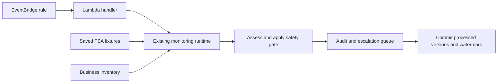

# AllerGuard · Scheduled AWS Cycle

This directory contains the infrastructure for running AllerGuard's monitoring cycle automatically on AWS. It demonstrates that a scheduled invocation can assess recalls, record outcomes, and remember which alert versions have already been processed.

**[Project overview](../../README.md)** · **[Public demo](https://allerguard-7se.pages.dev)**

The public demo runs independently in the browser. It does not invoke this AWS deployment.

## Recorded result

The isolated proof completed on **13 September 2026** in **Europe (London), `eu-west-2`**, using stack `allerguard-cycle-proof-v2`.

| Run | Recorded outcome |
|---|---|
| First scheduled run, 22:00:27 UTC | `committed`: five alerts assessed, two handled silently, three escalated. |
| Next recorded scheduled run, 22:10:28 UTC | `empty`: zero new alerts and unchanged progress marker. |

After the proof, the stored evidence was:

| Table | Items |
|---|---:|
| Business | 1 fictional café |
| Ledger | 6: five processed alert versions and one progress marker |
| Audit | 8 events |
| Escalation queue | 3 pending escalations |

The recorded progress marker, also called a watermark, was `2026-09-04T18:39:45.509Z`. The tables use the prefix `allerguard-cycle-proof-20260913`.

**The EventBridge rule was disabled after the proof.** These are recorded results, not a claim that the system is currently monitoring.

## What this proves

- EventBridge triggered Lambda without a manual invocation.
- The existing Python runtime processed five saved FSA alerts.
- Real DynamoDB tables stored the assessments, queue entries, and progress.
- The next poll recognised that those alert versions had already been processed.

Assessment and action-draft proposals were fixed inputs. Notifications were disabled. This proof did not exercise live Bedrock, live FSA polling, owner decisions, diary filing, SES/SNS delivery, or stock/customer actions.

Separate evidence for other parts of the project is described in the [root README](../../README.md).

## Architecture



The Lambda handler calls `run_monitoring_cycle`. It accepts only completed or empty outcomes as success; incomplete processing raises an error. It reads configuration from its environment rather than trusting table names or model settings supplied in an invocation event.

## Files

| File | Purpose |
|---|---|
| [template.yaml](template.yaml) | Lambda, IAM role, CloudWatch log group, EventBridge rule, and invocation permissions. |
| [requirements-linux.lock](requirements-linux.lock) | Dependency list for the Python 3.12 Linux package. |
| [prepare_cycle_proof.py](../../scripts/prepare_cycle_proof.py) | Commands for provisioning dedicated tables and packaging code. |
| [cycle_proof.py](../../src/tools/cycle_proof.py) | Provisioning and packaging implementation. |
| [scheduled_cycle.py](../../src/runtime/scheduled_cycle.py) | Lambda entry point. |
| [test_scheduled_cycle.py](../../tests/test_scheduled_cycle.py) | Offline checks for the scheduled entry point. |

## Deployment settings

The template uses:

| Setting | Value |
|---|---|
| Runtime | Python 3.12, Linux x86_64 |
| Memory / timeout | 1,024 MB / 300 seconds |
| Reserved concurrency | 1 |
| Schedule | Every 15 minutes; disabled by default |
| Proposal mode | `injected` by default |
| FSA source | Bundled `fixtures/cycle.json` |
| Notifications | Disabled; the handler rejects enabled notifications |
| Automatic retries | Zero at both the EventBridge target and Lambda asynchronous invocation boundaries |
| CloudWatch log retention | 14 days |

The interval above describes the current repository template. The timestamps in the recorded-result section describe the historical run evidence.

The template expects four existing DynamoDB tables and a deployment ZIP in S3. It does not create those tables or the code bucket.

## Prepare a new proof

Use this procedure only when another AWS verification is needed. Viewing the public demo does not require deploying these resources.

Run local commands from the repository root with Python 3.12 dependencies installed as described in the [setup guide](../../README.md#run-locally). AWS provisioning requires an authenticated profile with appropriate permissions and can incur charges.

### 1. Create isolated tables

Choose a new prefix beginning with `allerguard-cycle-proof-`. Do not reuse the completed proof's ledger for a new first-run demonstration.

For example:

```powershell
$env:AWS_PROFILE = "allerguard-dev"
.\.venv\Scripts\python.exe -m scripts.prepare_cycle_proof provision --prefix allerguard-cycle-proof-newrun
```

The command creates tables ending in `-business`, `-ledger`, `-audit`, and `-queue`, then seeds the fictional `demo-cafe`. Confirm the chosen prefix is unused before provisioning. The helper uses `eu-west-2`.

### 2. Build the Linux package

Use a new, empty package directory. Do not copy the Windows virtual environment into Lambda.

```powershell
.\.venv\Scripts\python.exe -m pip install --no-deps --platform manylinux2014_x86_64 --implementation cp --python-version 3.12 --only-binary=:all: --target artifacts/cycle-package-newrun -r infra/cycle/requirements-linux.lock
.\.venv\Scripts\python.exe -m scripts.prepare_cycle_proof package --folder artifacts/cycle-package-newrun --archive artifacts/cycle-proof-newrun.zip
```

The packaging command adds `src/`, generates `fixtures/cycle.json`, and creates the archive. The explicit dependency list and `--no-deps` avoid resolving Windows-only dependencies into the Linux package.

### 3. Deploy with the schedule disabled

Upload the ZIP to a private S3 code bucket in the deployment region. Validate and deploy `template.yaml` through CloudFormation, acknowledging its IAM role creation.

Supply these parameters:

| Parameter | Supply |
|---|---|
| `CodeBucket` / `CodeKey` | Bucket and object key for the uploaded ZIP |
| `BusinessesTable` | Your prefix plus `-business` |
| `LedgerTable` | Your prefix plus `-ledger` |
| `AuditTable` | Your prefix plus `-audit` |
| `EscalationsTable` | Your prefix plus `-queue` |
| `ProposalMode` | `injected` |
| `ScheduleState` | `DISABLED` |

Keep reserved concurrency at one. The account must have sufficient available concurrency for that reservation. Use a new stack name for a fresh proof; leave the existing evidence and AgentCore hello resources intact.

### 4. Capture the scheduled evidence

1. Confirm deployment succeeded, the business is seeded, and the new ledger is empty.
2. Enable the schedule by updating `ScheduleState` to `ENABLED`.
3. Inspect the CloudWatch group `/allerguard/cycle/<stack-name>`.
4. Save the `scheduled_cycle` report and invocation details from the first scheduled run.
5. Check the four tables against the expected counts above.
6. Capture a later `empty` result with unchanged watermark.
7. Set `ScheduleState` back to `DISABLED` after verification.

A successful manual invocation consumes the first batch too, so do not run one before collecting unattended first-run evidence. The initial audit count is **eight**, rather than the offline notification demo's eleven, because notifications are disabled.

## Permissions and resolved issues

The original deployment encountered a Lambda concurrency restriction. The recorded account quota was subsequently increased to 1,000, allowing the reservation of one execution.

Execution then exposed a missing `dynamodb:Scan` permission: `list_seen_versions()` scans the alert ledger. The current template grants **Scan only on the ledger table**.

The role also permits reads across the four tables, writes to the ledger/audit/queue, and log writes. It explicitly denies update, delete, batch-write, and table-deletion operations on the audit and queue tables. Conditional application writes enforce first-write retention; these permissions do not make the tables tamper-proof.

The default role has no Bedrock or SES/SNS permissions. Although `bedrock` is an allowed proposal setting, selecting it alone is insufficient: model permissions and live verification would also be needed.

Docker was unavailable during the original packaging work. The later successful Lambda executions establish that the deployed package ran; they do not establish that every future rebuilt package will import successfully.

## Local checks and limitations

Run the focused offline checks:

```powershell
.\.venv\Scripts\python.exe -m pytest tests/test_scheduled_cycle.py -q
git diff --check
```

These tests use local emulation and do not deploy AWS resources.

Reserved concurrency and disabled retries do not guarantee exactly-once delivery or an atomic update across all records. Investigate failed or uncertain runs before repeating them.

This is a bounded scheduled-cycle proof. Full AgentCore deployment, a scheduled daily diary, live feed/model execution in this cycle, and external notification delivery remain separate work.
